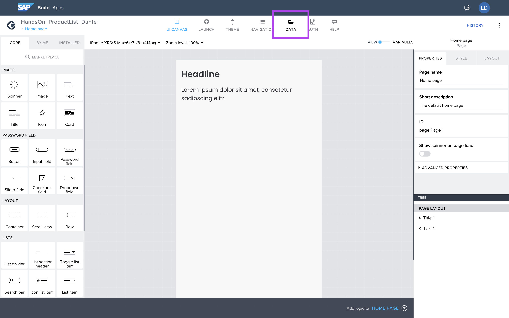
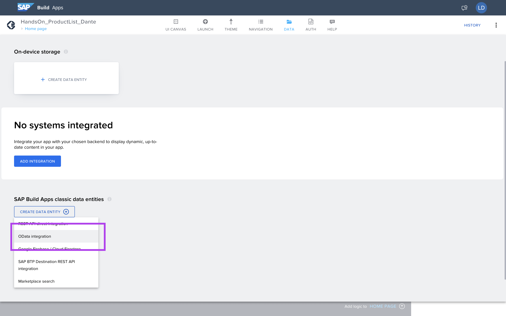
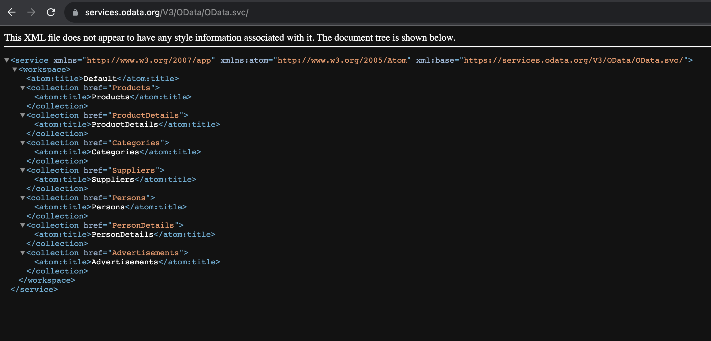
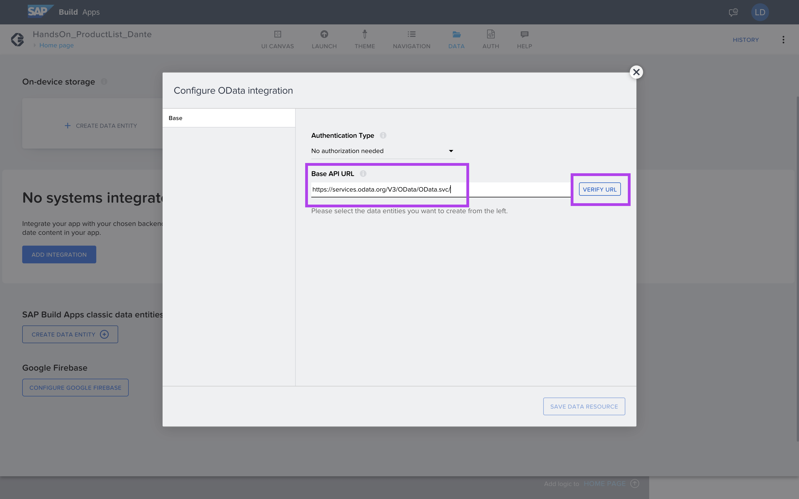
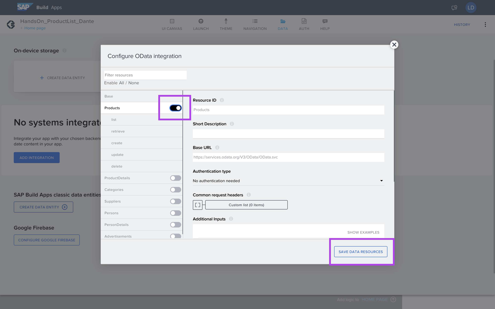
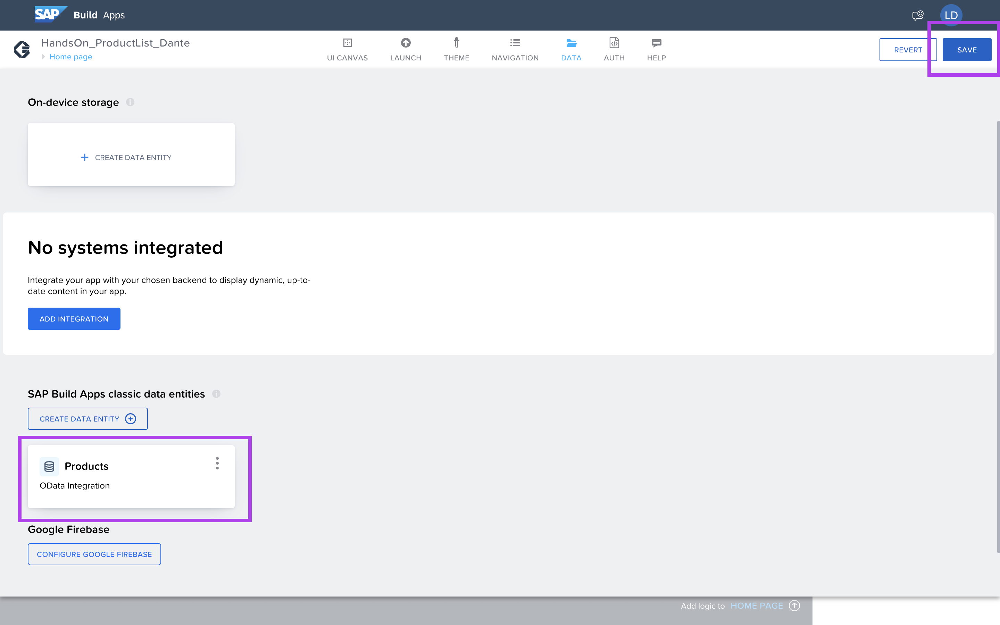
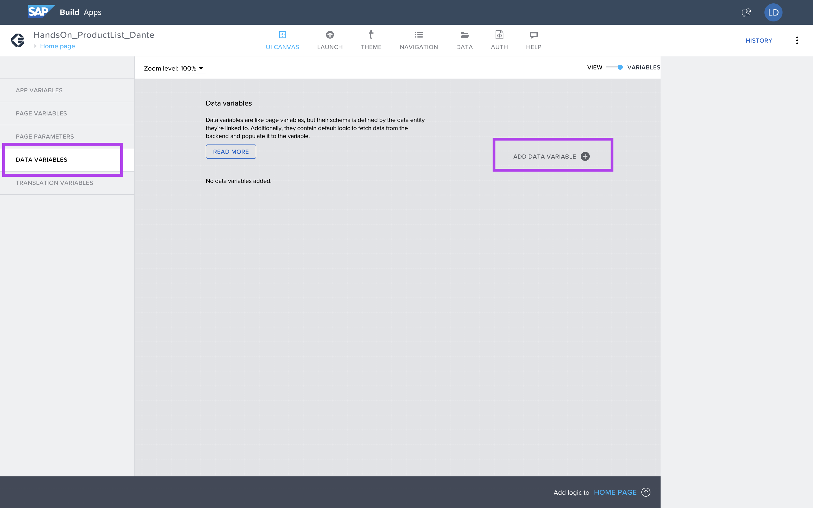
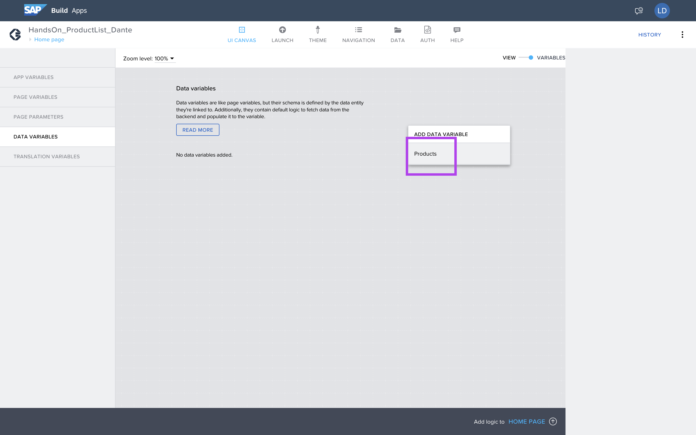
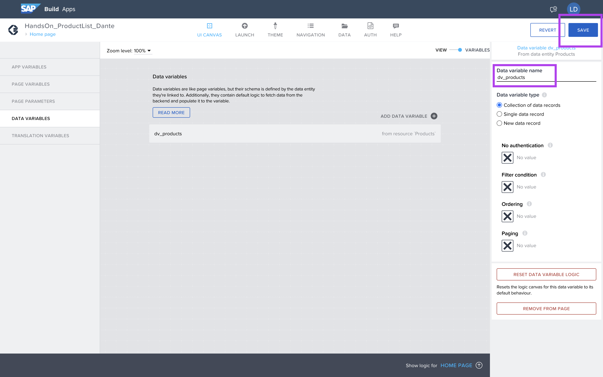
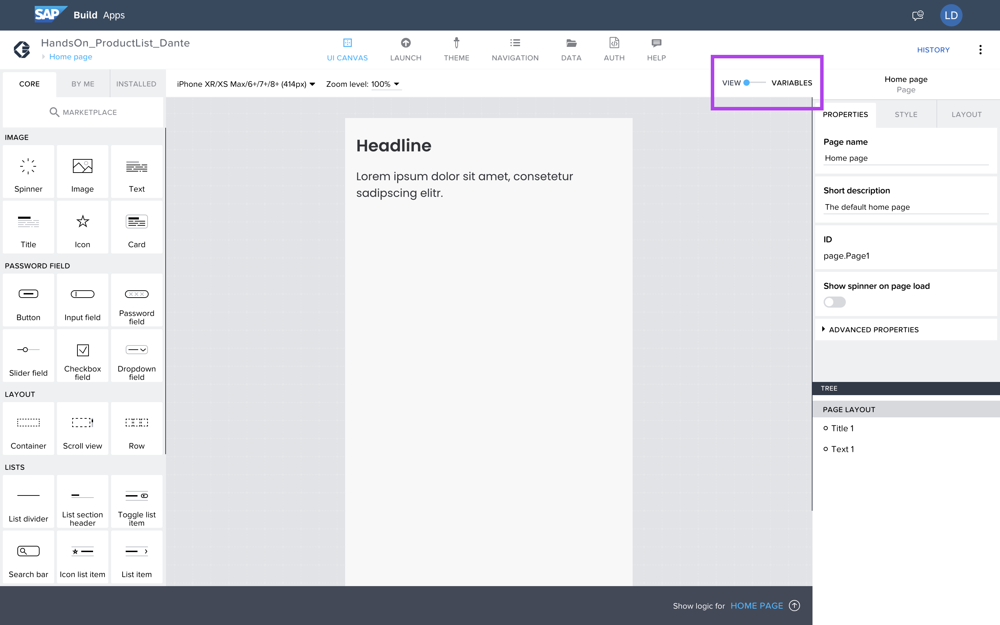

# Exercício 2 - Configuração do Data Provider

Agora vamos fazer a integração com o nosso Backend.

Navegue para a aba __Data__.



Nesta aba temos muitas opções de integrações.
Sendo integração com o SAP S/4, também utilizando o Conectivity > Destination.

No nosso cenário utilizaremos __OData Integration__.



Esse é o metadata do nosso backend

https://services.odata.org/V3/OData/OData.svc/



Cole o endpoint no Base API URL, e clique em __Verify URL__, para carregar as entidades presentes do metadata.



Selecione a entidade Products.

E salve, Clique __SAVE DATA RESOURCES__.



Agora temos a entidade __Products__ disponivel.

Clique em __Save__.



Tendo o __Data__ já configurada, temos que adicionar na nossa página, volte para o Canvas, clicando em __UI Canvas__.

Para acessar as variaveis, podemos clicar no Swich Button, e acessar as variveis da página.


Na Aba Data Variables, clique em __ADD DATA VARIABLES__.



E Selecione a entidade Products.



Renomeie para
```
dv_products
```

E salve, clicando em __SAVE__.



Volte para o formato gráfico clicando novamente no Switch Button.



## Próximo Passo:

[Exercício 03 - Criação da Home Page](/exercises/ex3/README.md)

