# Exercício 4 - Navegação entre Home Page e Detail

Neste step vamos construir a navegação entre a HomePage e a DetailPage, onde irá conter os dados do produto de forma detalhada.

No canto superior esquerdo, clique em __Home Page__, para acessar a sumarização de todas as páginas.

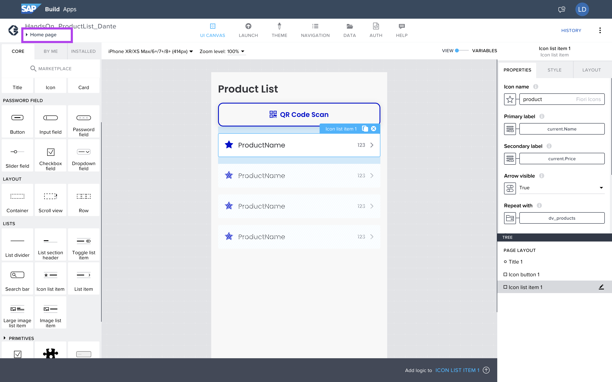

Adicione uma nova página, clique em __ADD NEW PAGE__.

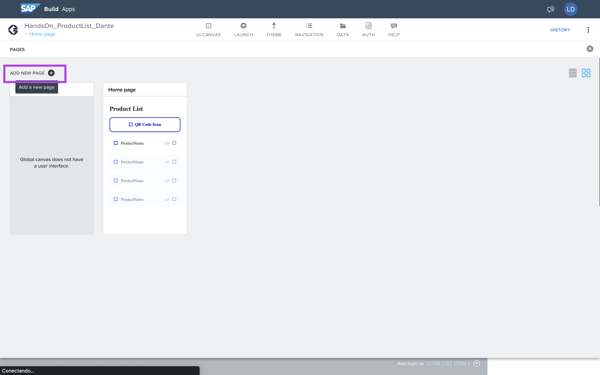

Nomeie como Product Detail.
Clique em __OK__.


Com a nova página criada, acesse as variavéis para configurar as PAGE PARAMETERS.

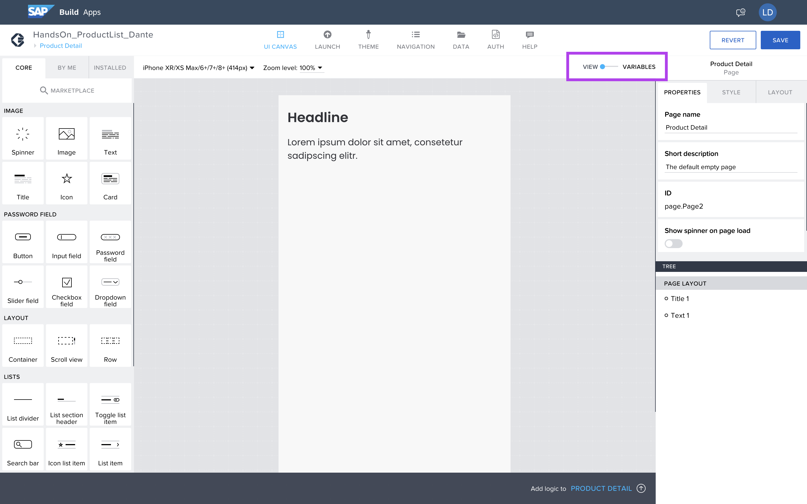

No menu lateral esquerdo, selecione __PAGE PARAMETERS__.

Clique __ADD PARAMETERS__.

Configure o nome do Parameter como:

```idproduct```

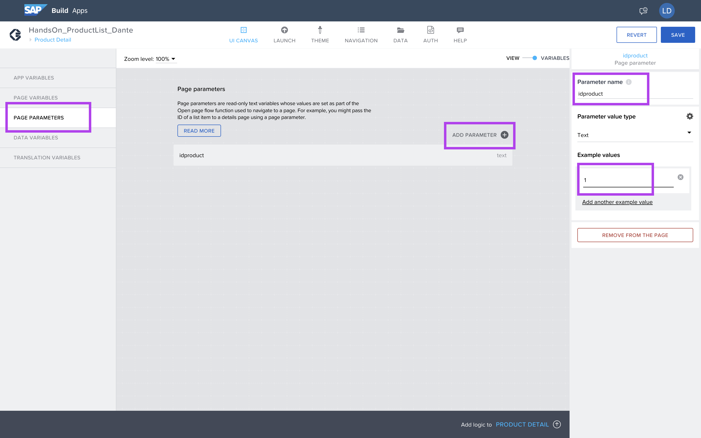

Volte para o editor gráfico, clicando no switch button.


Acesse o menu de navegação clicando no canto superior esquerdo, na label azul.

E navegue para a home page, para adicionar a lógica de navegação..

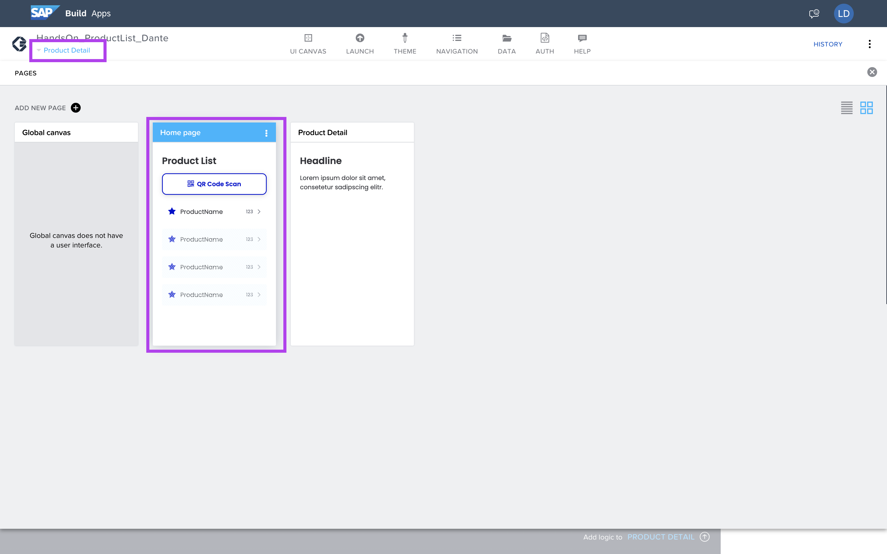

Selecione a lista de produtos para adicionar lógica.

Clique em: __Add logic to ICON LIST ITEM 1__.

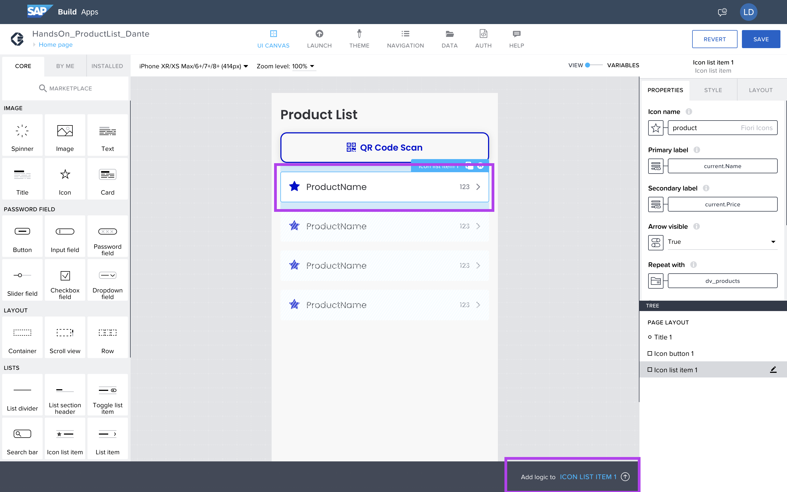

Nos elementos de lógica adicione: __Open page__.

E conecte o evento para o navegation.

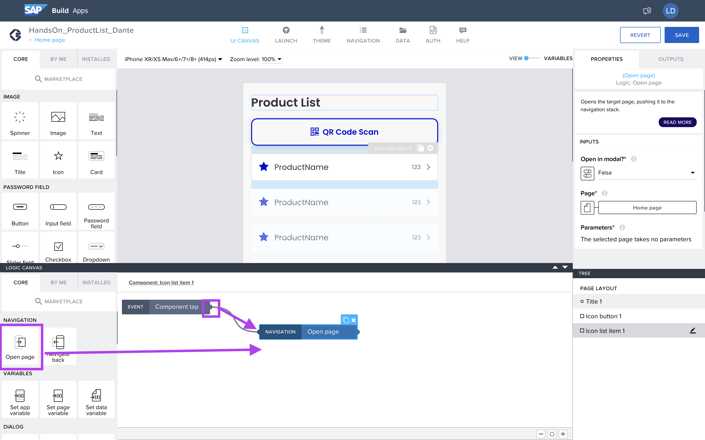

Selecione a pagina que irá abrir, em __Page__.

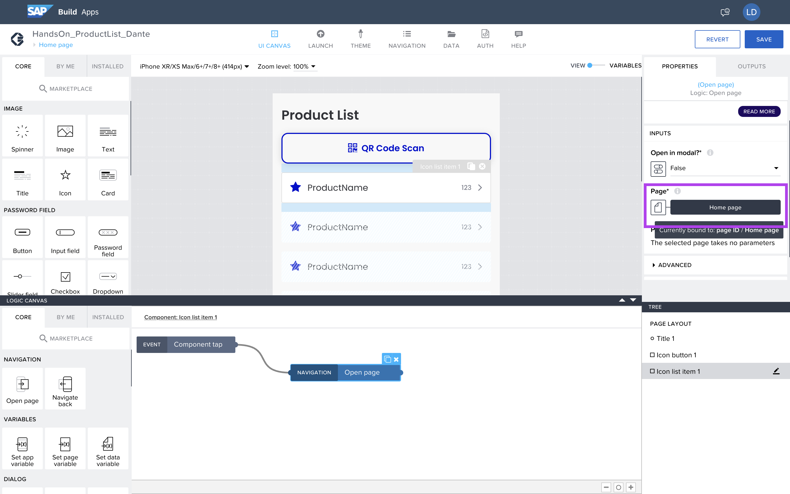

Selecione a página __Product Detail__ e __Save__.


Habilitará um campo: __idproduct__.

Selecione qual o elemento que irá aplicar como valor.

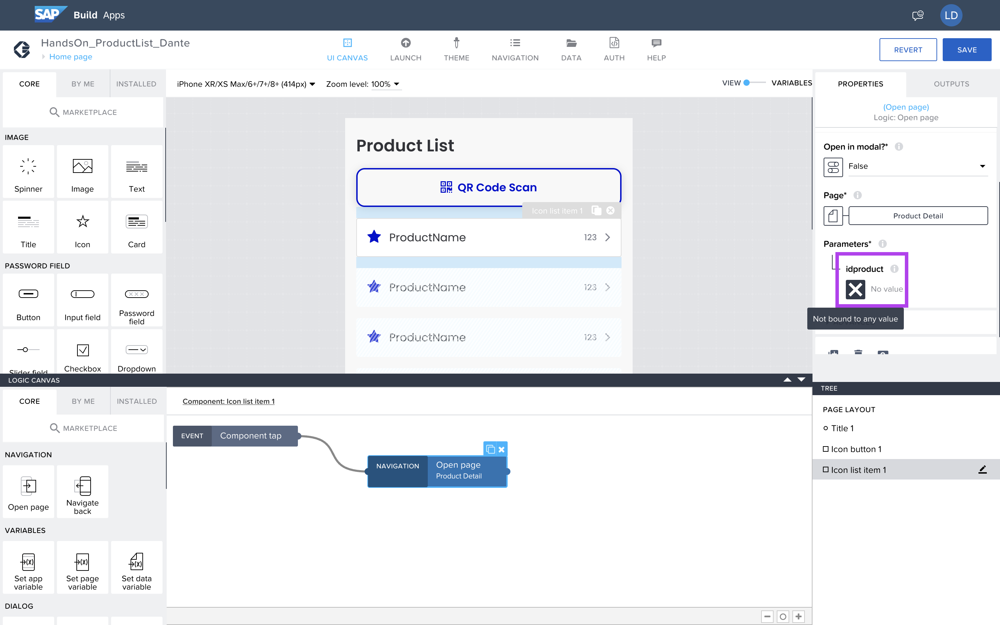

Selecione __Formula__.

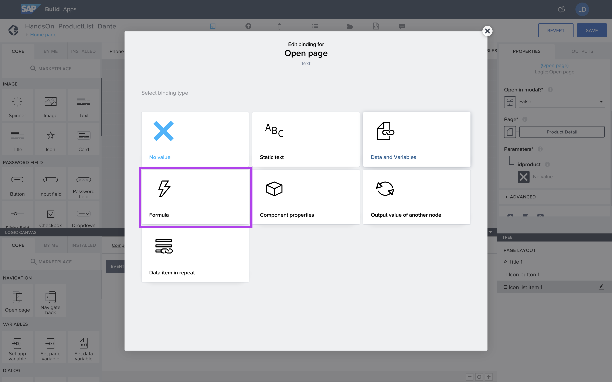

Selecione __Create formula__.

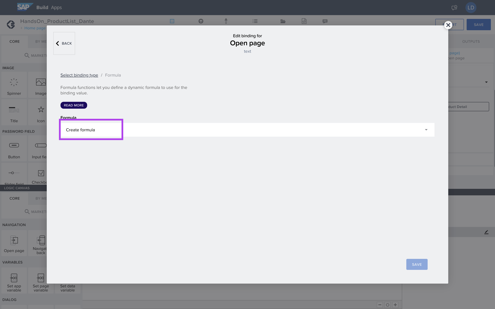

Preencha no campo:

STRING(repeated.current.ID)

E salve a fórmula.

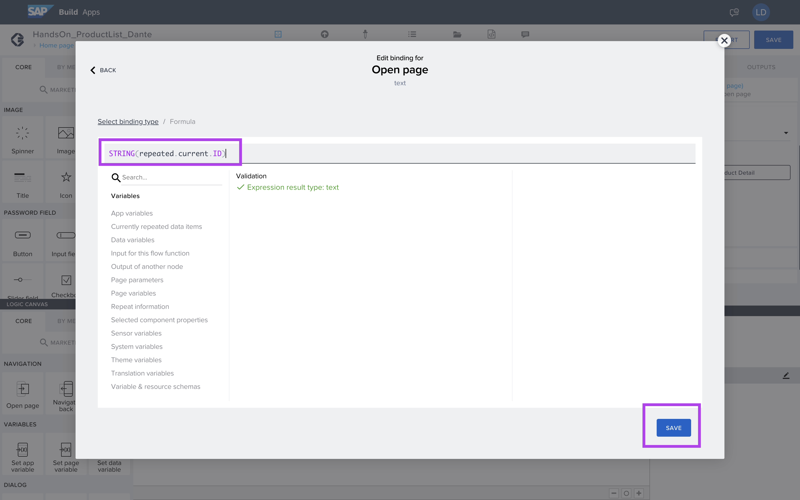

## Próximo Passo:
[Exercício 05 - Criação da Detail Page](/exercises/ex5/README.md)